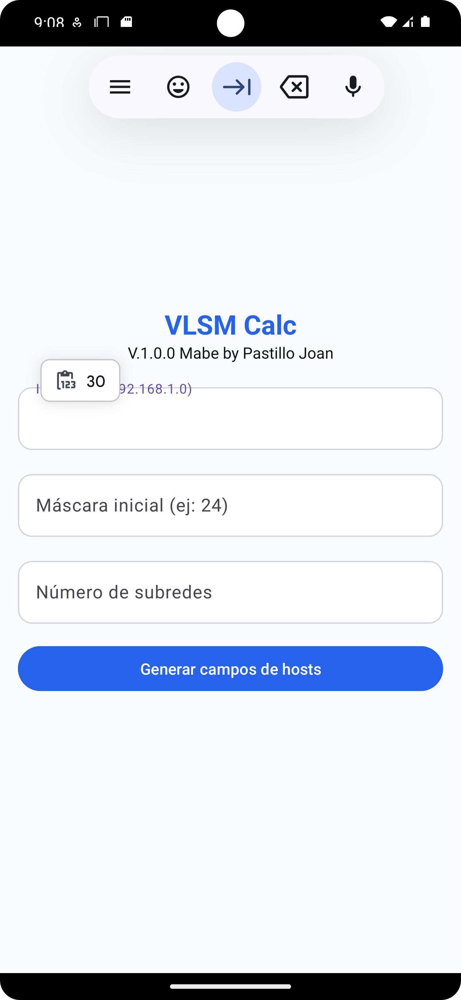
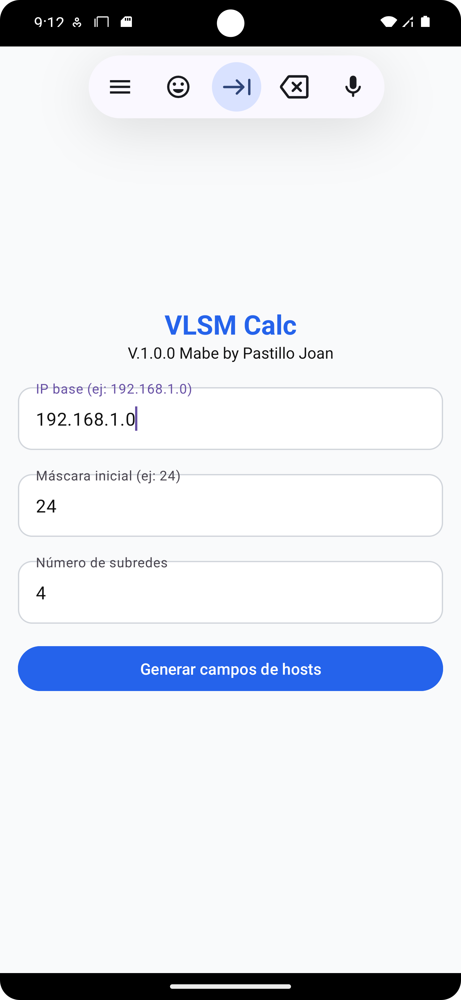
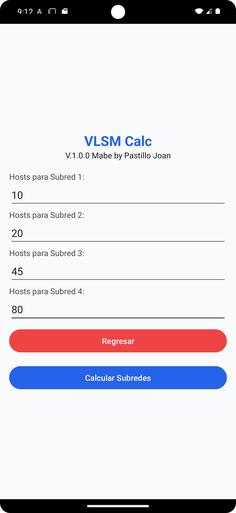
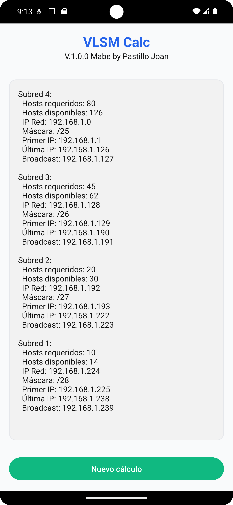
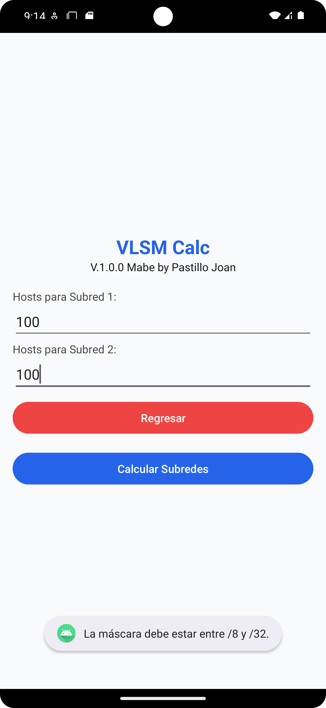

# 📱 Calculadora de Subredes VLSM

Aplicación móvil desarrollada en Android Studio que permite calcular subredes a partir de una IP base, máscara inicial y número de subredes. Ideal para prácticas de redes y subnetting.

---

## 📷 Capturas de Pantalla Aplicación


📲 Flujo Completo de Uso
<p align="center">     </p>
⚠️ Validación y Retroalimentación
<p align="center">  </p>

    La aplicación detecta errores en los datos ingresados y notifica al usuario para corregirlos antes de continuar.

---

## 🔧 Especificaciones del Proyecto

- **Lenguaje principal:** Kotlin 
- **IDE:** Android Studio Koala Feature Drop | 2024.1.2
- **Versión de compilación:** API 35
- **Emulador utilizado:** Pixel 6 Pro API 36
- **Compatibilidad mínima:** API 24
- **Dependencias externas:** Ninguna 

---

## 🚀 Cómo Ejecutar el Proyecto

1. Clona el repositorio:
   ```bash
   git clone https://github.com/tu-usuario/tu-repo.git
